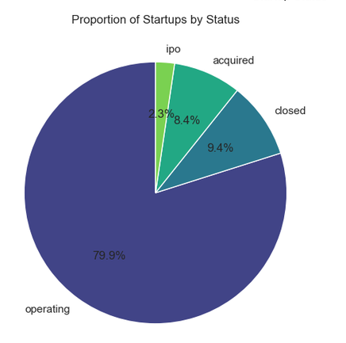

# Startup Business Outcome Analysis

## Overview

This project explores a dataset of startup businesses to examine how funding and recorded company status vary across businesses. The goal is to understand the data and prepare for a later model that predicts a clearly defined business outcome.

**Project status:** Exploratory analysis complete; predictive modeling planned.

## Questions

- How is total funding distributed across startups?
- What proportion of businesses have each recorded status?
- How does funding differ by status?
- What data preparation is needed before building a predictive model?

## Initial findings

Funding is highly uneven: a relatively small number of startups account for much of the total. Nearly 80% of records are labeled *Operating*, while just over 9% are labeled *Closed*. These labels require care when defining a prediction target. An operating business has not necessarily achieved long-term success, and its eventual outcome may still be unknown.



## What the notebook does

The [analysis notebook](analysis/PredictSuccess_StartupBusinesses.ipynb) loads and inspects the dataset, reviews missing values and data types, prepares funding fields for analysis, and visualizes funding and company status. It also outlines the work needed to develop and validate a predictive model.

## Repository contents

| Path | Description |
|---|---|
| [`analysis/PredictSuccess_StartupBusinesses.ipynb`](analysis/PredictSuccess_StartupBusinesses.ipynb) | Data preparation and exploratory analysis |
| [`data/`](data/) | Startup dataset |
| [`images/`](images/) | Charts produced for the analysis |
| [`requirements.txt`](requirements.txt) | Python packages for the project |

## Running the analysis

Install the packages in `requirements.txt`, then open the notebook in Jupyter and run its cells in order.

```bash
pip install -r requirements.txt
```

**Before running the notebook:** Check that the filename in its `pd.read_csv()` call matches the CSV in `data/`. They currently differ.

## Limitations and next steps

The current analysis describes associations in the recorded data; it does not establish that funding causes a particular outcome. The status categories also need a more precise definition before they can serve as a prediction target. Next steps are to define the outcome and prediction date, prevent information from later in a startup’s history from entering its predictors, train a baseline model, and evaluate the model on held-out data.
